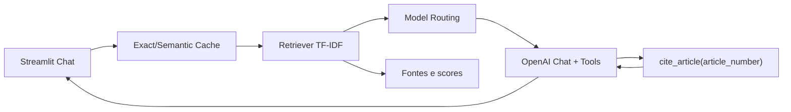

# LGPD Copilot

Assistente RAG para perguntas de compliance LGPD em produtos digitais. O app responde usando um corpus local estruturado, cita artigos relevantes com uma ferramenta customizada e reduz custo com cache + roteamento de modelo.

## Problema

Times de produto e engenharia tomam decisoes frequentes sobre CPF, logs, retencao, incidentes, dados sensiveis e direitos do titular. Muitas perguntas nao sao respondiveis com conhecimento generico: precisam citar artigo, contexto e limites.

## Demo

- URL publica da demo: `PREENCHER_APOS_DEPLOY`
- Repositorio: https://github.com/esleiu/lgpd-copilot
- Video demo: `PREENCHER_APOS_GRAVACAO`

## Arquitetura



## Componentes

- `src/pipeline/rag.py`: carrega corpus, faz chunking, retrieval e orquestra resposta.
- `src/pipeline/tools.py`: tool customizada `cite_article(article_number)`.
- `src/pipeline/cache.py`: cache exato e cache semantico por similaridade TF-IDF.
- `src/pipeline/routing.py`: roteamento cheap-first para reduzir custo.
- `src/ui/streamlit_app.py`: interface de chat com fontes e metricas de custo.

## Corpus

Corpus textual em `data/corpus/lgpd_corpus.md`, com 14 paginas estruturadas sobre LGPD:

- objetivos e fundamentos;
- definicoes;
- principios;
- bases legais;
- consentimento;
- dados sensiveis;
- direitos do titular;
- termino do tratamento;
- seguranca e incidentes;
- cenarios de desenvolvimento.

Fontes oficiais para validacao:

- Lei 13.709/2018: https://www.planalto.gov.br/ccivil_03/_ato2015-2018/2018/lei/l13709.htm
- ANPD: https://www.gov.br/anpd/pt-br/documentos-e-publicacoes

## Perguntas de teste

1. Posso armazenar CPF para emitir nota fiscal e prevenir fraude?
2. Quais direitos o usuario tem se pedir exclusao dos dados?
3. Que medidas tecnicas devo aplicar se meu app guarda dados de saude?
4. Quando posso manter dados apos o fim do contrato?
5. O que fazer se ocorrer vazamento de dados pessoais?

## Setup local

```bash
python -m venv .venv
source .venv/bin/activate
pip install -r requirements.txt
cp .env.example .env
streamlit run src/ui/streamlit_app.py
```

Sem `OPENAI_API_KEY`, o app roda em modo fallback usando retrieval local. Com `OPENAI_API_KEY`, usa LLM com tool calling.

## Deploy Streamlit Cloud

1. Subir este projeto em um repositorio publico no GitHub.
2. Criar app em https://share.streamlit.io.
3. Main file: `src/ui/streamlit_app.py`.
4. Em secrets, adicionar `OPENAI_API_KEY`.
5. Confirmar que a URL abre em janela anonima.

## Custo e latencia

Medida de reducao implementada:

- Cache exato: pergunta repetida custa zero chamada LLM.
- Cache semantico: perguntas muito parecidas reaproveitam resposta.
- Routing cheap-first: perguntas simples usam `OPENAI_MODEL_CHEAP`; perguntas complexas usam `OPENAI_MODEL_STRONG`.

Estimativa exibida na UI: chamada barata = 20% do custo da forte; cache = 0%.

## Decisoes de design

- TF-IDF foi escolhido para retrieval porque e deterministico, leve e funciona no deploy sem banco vetorial externo.
- Tool `cite_article` evita que o modelo invente artigo quando o usuario pede citacao.
- Fallback sem API garante que a demo nao quebre se a chave estiver ausente ou em rate limit.

## Limites

- O app nao substitui parecer juridico.
- O corpus e um recorte estruturado para fins didaticos; para producao, usar texto integral atualizado da LGPD e guias da ANPD.
- O cache semantico pode reaproveitar respostas para perguntas parecidas demais; o threshold deve ser calibrado.
- TF-IDF nao entende sinonimos tao bem quanto embeddings neurais.

## Testes

```bash
pytest
```

## Roteiro do video demo (ate 3 min)

1. Aluno A: problema e corpus escolhido (30s).
2. Aluno A: fluxo RAG + tool `cite_article` funcionando (60s).
3. Aluno B: cache/routing e reducao de custo na sidebar (45s).
4. Aluno B: decisao de design e limites (45s).
